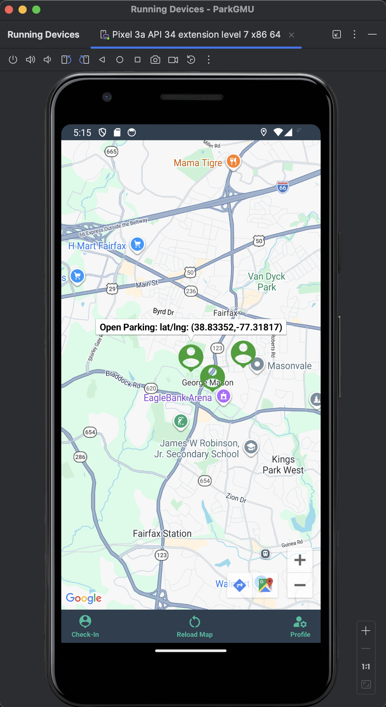
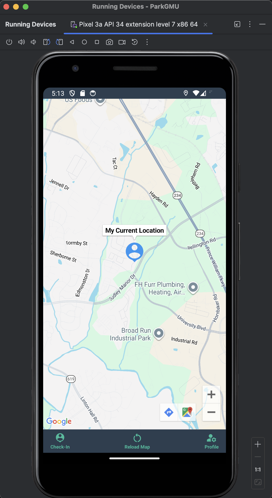

# 🚗 ParkGMU — Smart Campus Parking App

## 📌 Overview
ParkGMU is a real-time, crowd-powered Android application that helps students at George Mason University find and share parking availability using Google Maps and Firebase.

---

## 📸 App Screenshots

### 🏠 Welcome Screen


### 🔐 Login Screen


### 🗺️ Parking Map (Available Spots)


### 📍 Check-In (Claimed Spot)


### 📍 Current Location


### 👤 User Profile


---

## ✨ Features

- 🔐 Firebase Authentication (Sign Up / Sign In / Email Verification)
- 🗺️ Google Maps integration with real-time markers
- 📍 Check-In / Check-Out parking system
- 🚘 Navigation to parked vehicle
- 👤 User profile with parking info
- 🔄 Persistent login sessions

---

## 🏗️ Tech Stack

- **Frontend:** Android (Java, XML)
- **Maps:** Google Maps SDK
- **Backend:** Firebase Firestore
- **Authentication:** Firebase Auth
- **Location:** Android Location Services

---

## ⚙️ Setup Instructions

### 1. Clone the repo
```bash
git clone https://github.com/your-username/parkgmu.git
